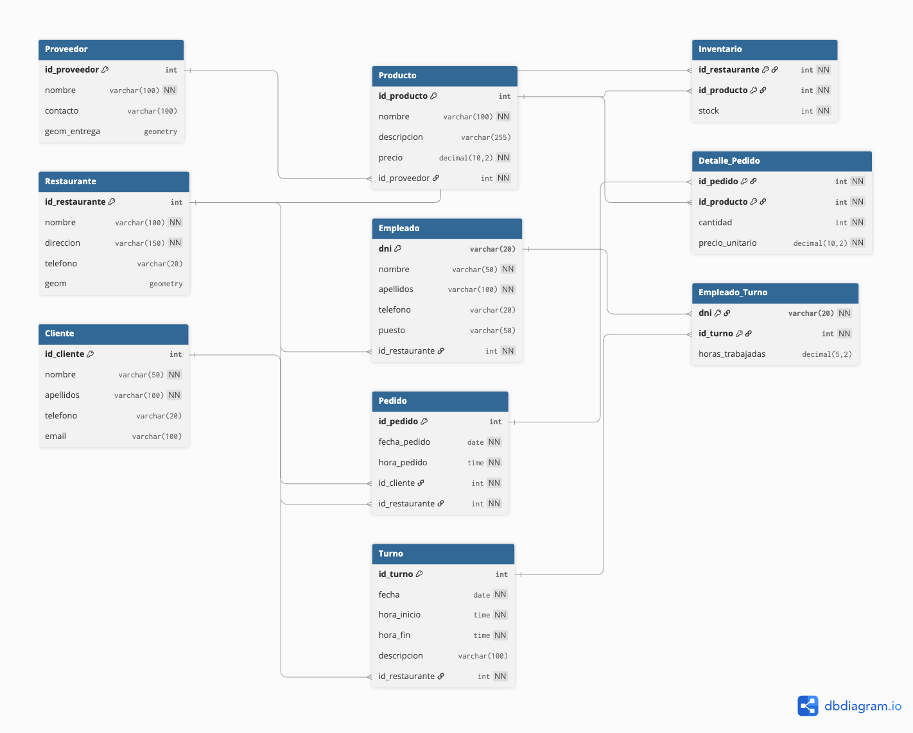

# 🗄️ Diseño lógico de base de datos – Sistema de restauración rápida

## 📌 Descripción
Este proyecto presenta el diseño lógico de una base de datos para la gestión de un sistema de restauración rápida. Incluye el modelado entidad–relación (E-R) y su estructuración lógica.

Se han aplicado principios de:
- Normalización (3FN)
- Integridad referencial
- Escalabilidad del sistema

## 🧠 Modelo de datos
El sistema se organiza en torno a la entidad **Pedido**, que conecta clientes, productos y restaurantes.

## 📊 Diagrama E-R

## ⚙️ Tecnologías utilizadas
- Modelado entidad–relación
- SQL (diseño lógico)
- Normalización de bases de datos (3FN)

## 📄 Informe completo
[Ver informe en PDF](informe.pdf)

## 🚀 Posibles mejoras
- Implementación en PostgreSQL/PostGIS
- Integración con SIG para análisis espacial
- Desarrollo de consultas avanzadas

## 👤 Autor
Ronald Álvarez Vaca
